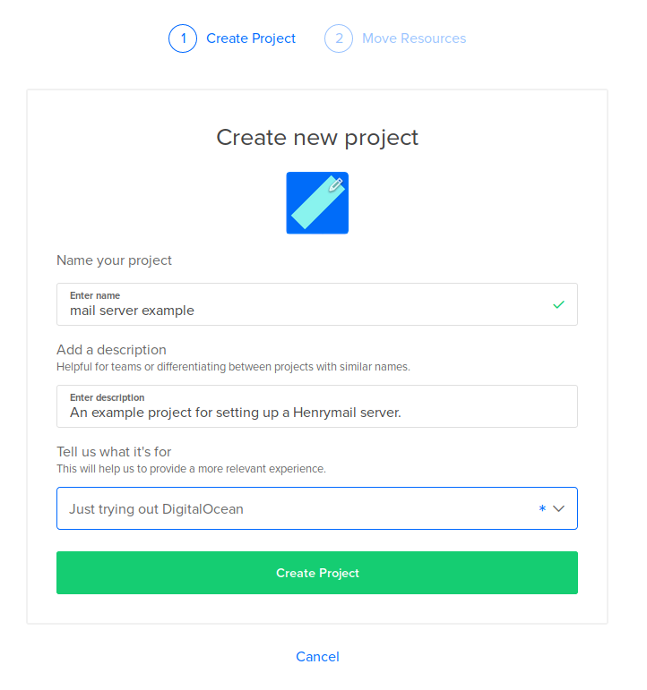
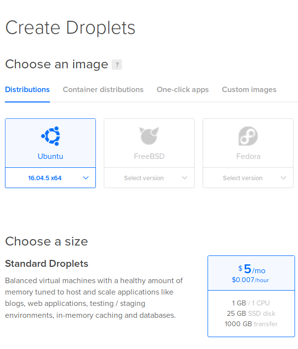
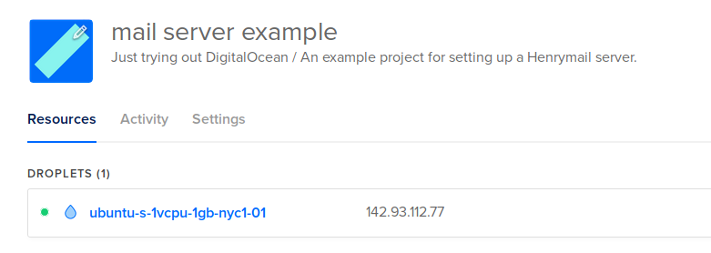
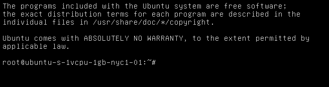
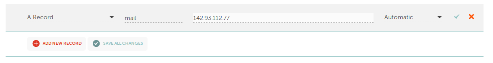
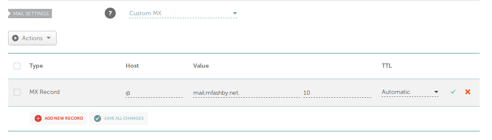
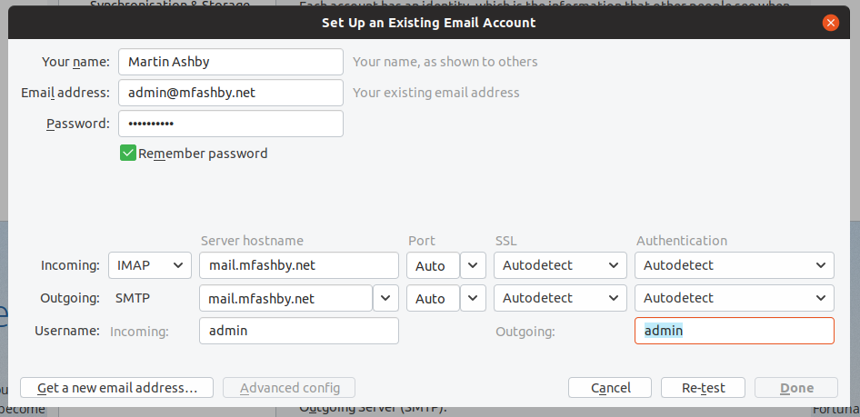
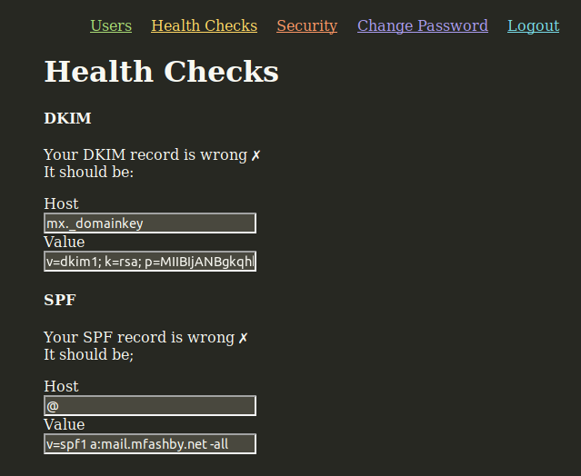
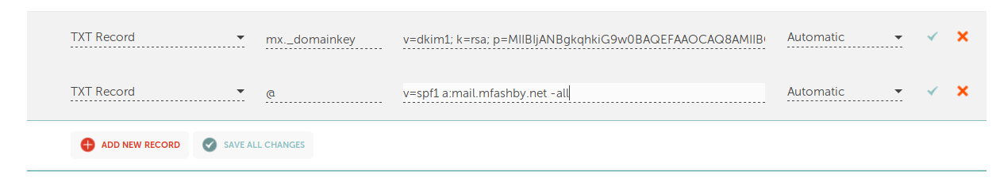
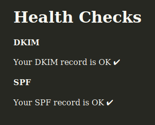

Installation and usage
======================
PLEASE REMEMBER THIS IS INCOMPLETE SOFTWARE, AND 
MAY HAVE SECURITY ISSUES AND BUGS. USE AT YOUR OWN
RISK. 

At the end of the guide, you will have an email
server that lets you send and receive emails 
from your own domain.

Before you begin
----------------
You will need a domain name, e.g. `mfashby.net` or 
`janedoe.com`. I use [Namecheap](https://www.namecheap.com/)
, but other domain name providers are available.
If you want to follow this guide exactly, you will 
need to create an account with Namecheap and log in.

You will need a server with a fixed IP address. For
this guide I am going to use a server from 
[Digital Ocean](https://www.digitalocean.com/). Other 
providers are available. The software will run on 
most operating systems. If you want to follow this 
guide exactly, you will need to create an account 
with Digital Ocean and log in.

Set up a server
---------------
Log into Digital Ocean. Select New Project and fill the required fields.

 

Create a new droplet. I'm going to create one with the Ubuntu 16.04
operating system. Henrymail doesn't need much resource, so I'm going
to use the cheapest price plan.



Once you have created your droplet, write down it's IP address. 
This should be visible on the Project page. 



You will be emailed the username and password for accessing the droplet. 
Click on `...` > `Access Console` to log into the droplet, and enter the 
username and password that were emailed to you. You will be prompted to 
enter a new password. Don't forget it! Once you have entered the new 
password, you'll be presented with a terminal like this in your browser:

  

You can then run the following commands to build and install the software.
Copy each line into the terminal and press enter to run it. Make sure
to check for error messages after each one. You may need to work out what 
has gone wrong 

First you need to install the `gcc` and `go` compilers, and an `embed` tool. 
Detailed instructions are available on the [go website](https://golang.org/doc/install), 
but the following commands are a condensed version for this guide. 
```bash
apt install -y gcc 

wget https://dl.google.com/go/go1.11.5.linux-amd64.tar.gz
tar -C /usr/local -xzf go1.11.5.linux-amd64.tar.gz
export PATH=$PATH:/usr/local/go/bin

go get github.com/aprice/embed/cmd/embed
export PATH=$PATH:~/go/bin/
```

Next you need to download the source code for henrymail
```bash
git clone https://gogs.mfashby.net/martin/henrymail.git
cd henrymail
```
Then build it
```bash
go generate web/web.go
go build
```
Then copy it into place in the system, and allow it to be run as
a program, and allow it to bind to the ports it needs
```bash
cp henrymail /usr/bin/henrymail
chmod +x /usr/bin/henrymail
setcap 'cap_net_bind_service=+ep' /usr/bin/henrymail
```

These commands create a new user to execute the program, and grant the 
user access to the files and folders it needs (it's a good idea
to do this, service software shouldn't usually be running as an 
administrator for security reasons)
```bash
useradd -r henrymail
mkdir /var/lib/henrymail
chown henrymail:henrymail /var/lib/henrymail
```

These commands download the sample configuration file, and open it
for editing with nano. 
```bash
mkdir /etc/henrymail
wget -O /etc/systemd/system/henrymail.service https://gogs.mfashby.net/martin/henrymail/raw/master/henrymail.service
wget -O /etc/henrymail/henrymail.prop https://gogs.mfashby.net/martin/henrymail/raw/master/henrymail.sample.prop
nano /etc/henrymail/henrymail.prop
```

Change `example.com` for your domain name (e.g. `mfashby.net`) everywhere
that it appears in this file. Press `ctrl+x` to save, then press `Y` to save 
changes. See [CONFIG.md](CONFIG.md) for an explanation
of all the available configuration options in this file.
Leave the terminal open, we'll come back to it later to start the server. 

Next we need to configure the DNS for your server. Log into Namecheap
and navigate to `Dashboard` > `Manage` > `Advanced DNS`. 

Add a new A record for host `mail`, and fill in the IP address of your digital 
ocean droplet as the value (you wrote this down earlier). Click the tick to 
save it.
 

Allow a minute or so for this record to get updated across the DNS system. 
You can check it's progress on [whatsmydns.net](https://www.whatsmydns.net)

Return to the terminal, it's now time to start the henrymail server for 
the first time and check it works:
```bash
cd /var/lib/henrymail
sudo -u henrymail henrymail
```

The administrator username and a generated password will be shown in the 
terminal. Note them down. Open your web browser to access the administration 
interface, e.g. https://mail.mfashby.net/, and enter the username and password
. You can change the password to something more memorable here if you want.


Now you can enable it as a service so it will start whenever your droplet 
is restarted. Press `ctrl+c` to stop henrymail, then run the following:
```bash
systemctl daemon-reload
systemctl enable henrymail
systemctl start henrymail
```

Refresh the administration page again to check everything is working OK. 
You can now close the terminal!

We've almost got a working email server. Go back to Namecheap, and add 
a Custom MX record with host set to `@`, and value set to your mail server's name (with a trailing dot!):


Finally, you can connect your email client. Here I am using [Thunderbird](https://www.thunderbird.net)

Add a new account, and enter the details as follows:
* Incoming server should be IMAP, with your mail server name e.g. `mail.mfashby.net`
* Outgoing server should be SMTP, with your mail server name e.g. `mail.mfashby.net`
* Press 're-test', and thunderbird should automatically pick up the 
port numbers and SSL settings.
  

Press Done, and enter the admin password when prompted

You're done! Test your new configuration by sending an email to another
address that you own (or a friend)

Keep reading for further improvements to your server

SPF and DKIM records
====================
It's advisable to have Sender Policy Framework and DomainKeys Identified Mail 
records set up for your server. These help other servers to validate emails 
from your server, so your emails are less likely to be rejected. See 
[this article](https://blog.woodpecker.co/cold-email/spf-dkim/) for an explanation.

To set these up, log into the administration page, then click 'Health Checks'.


These text boxes show the entries you need to add to your DNS system in order 
for emails to be verified by other servers. Log into Namecheap and add the 
corresponding entries as TXT records:



Save these entries, and allow a couple of minutes for them to propagate through
the DNS system. Reload the 'Health Checks' page, it should now display a message
saying that your SPF and DKIM records are OK




Advanced Configuration
======================
Henrymail is compatible with some more advanced setups, e.g. if you are running a 
web server on the same server.

The complete list of configuration options is documented in 
[henrymail.full.prop](../henrymail.full.prop)

TODO
====
* Administration page guide to adding users.
* Ongoing administration (quotas, spam settings)